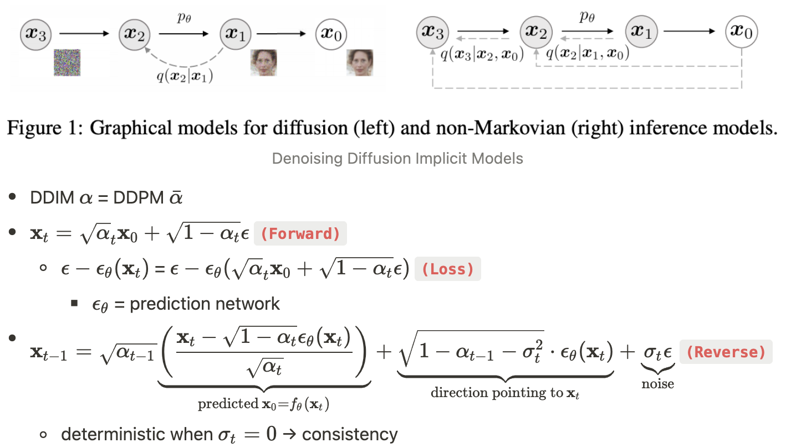

# Latent Diffusion in R-Tensorflow
This repository is a R-Tensorflow implementation of [Latent Diffusion](https://arxiv.org/abs/2112.10752). It contains the code of **AutoEncoder** and **U-Net** in Latent Diffusion.

## Detail
1. AutoEncoder is KL-VAE with the KL regularized loss and VGG19-based perceptual loss. VAE is used to compress images from pixel space to latent space. After the Encoder in VAE, the image resolution will be reduced by a factor of 4 (256x256 -> 64x64).
2. UNET consists of a series ofconvolutional residual block and Transformer encoder block (Self-Attention) with 170M parameters.
3. This model is a **unconditional** generative model.
4. Regarding the sampler, we only implemented DDIM.
<div align="left">
  
</div> (Source: https://github.com/taki0112/Diffusion-Tensorflow)

## Training set and results
- We train model with 140k images from Dannbooru. Some images from it:
<div align="left">
  
  
  
  
  
  
  
  
  
</div>
<br>
- Generated images (step = 200, $σ_t$ = 1.0)
<div align="left">
  
  
  
  
  
  
  
  
  
</div>
<br>
- Generated images (step = 50, $σ_t$ = 0.0，DDIM)
<div align="left">
  
  
  
  
  
  
  
  
  
</div>

## Requirements
The model is based on [Tensorflow for R](https://github.com/rstudio/tensorflow). The code was tested with R 4.3.1 and Python 3.9.17.
The required R packages listed as follows:
- Tensorflow 2.13+ ([Install in R](https://tensorflow.rstudio.com/install/))
- Keras 2.13+
- EBImage

## Usage
### Training
1. Prepare for images used for training.
    - Make sure that image's width is equal to height.
2. Change the hyperparameters and train VAE.
    ```
    Rscript train_vae.R
    ```
3. Compute the scale factor. Remember it.
    ```
    Rscript scale_factor.R
    ```
4. Change the hyperparameters and train U-Net.
    ```
    Rscript train_unet.R
    ```

### Inference
Use `Inference.Rmd` to load model U-Net `ema_unet(Epoch 50)` and VAE `VAE-f4`.

## References
- [High-Resolution Image Synthesis with Latent Diffusion Models](https://arxiv.org/abs/2112.10752)
- [Denoising Diffusion Probabilistic Models](https://arxiv.org/abs/2006.11239)
- [Denoising Diffusion Implicit Models](https://arxiv.org/abs/2010.02502)
- https://github.com/taki0112/Diffusion-Tensorflow
- https://keras.io/examples/generative/ddim/
- https://github.com/beresandras/clear-diffusion-keras
- https://github.com/CompVis/stable-diffusion
